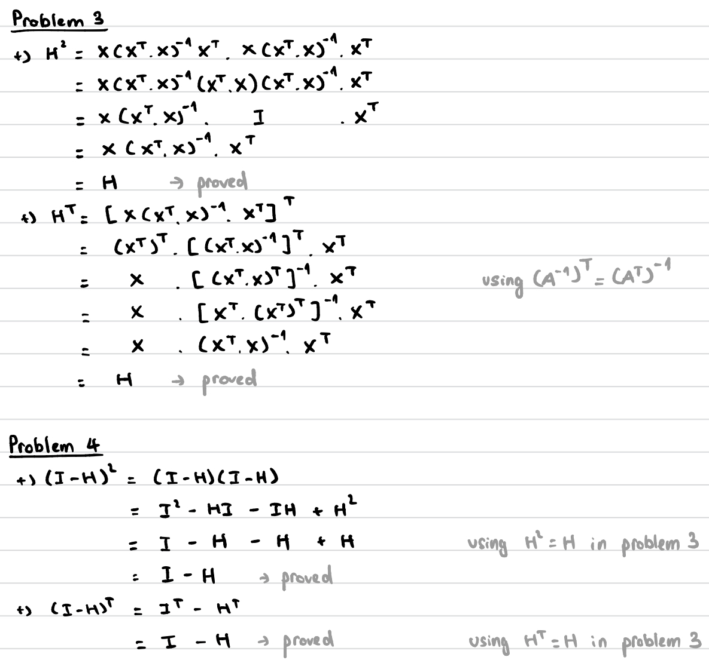
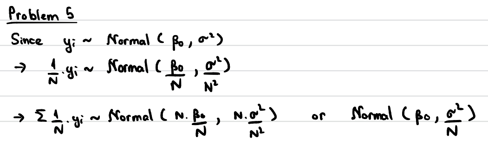

## Problem 1

Alone

## Problem 2

I did use ChatGPT for some simple revision of matrix operations (e.g. transpose of sum, inverse of transpose).

## Problem 3 & 4



## Problem 5



## Problem 6

In example where x2 is visible to y beta2 is selected to be large, whereas in the example where x2 is non-visible to y then beta2 is selected to be very small.

```{r}
set.seed(42)
N <- 100
x1 <- runif(N, min = 10, max = 20)
x2 <- rbinom(N, size = 1, prob = 0.5)

df <- data.frame(x1 = x1, x2 = x2)
# head(df)

# Example where x2 is visible to y
beta0 <- 0
beta1 <- 1
beta2 <- 8
var <- 1
e <- rnorm(N, mean = , sd = sqrt(var))

y <- beta0 + beta1*x1 + beta2*x2 + e

plot(df$x1, y, col = ifelse(df$x2 == 1, "blue", "red"),
     pch = 19, xlab = "x1", ylab = "y",
     main = "Scatter plot of y vs x1 colored by x2 (1: blue, 0: red)",
     sub = "Example where x2 is visible to y")

# Example where x2 is non-visible to y
beta0 <- 1
beta1 <- 1
beta2 <- 0.1
var <- 1
e <- rnorm(N, mean = , sd = sqrt(var))

y <- beta0 + beta1*x1 + beta2*x2 + e

plot(df$x1, y, col = ifelse(df$x2 == 1, "blue", "red"),
     pch = 19, xlab = "x1", ylab = "y",
     main = "Scatter plot of y vs x1 colored by x2 (1: blue, 0: red)",
     sub = "Example where x2 is non-visible to y")
```

## Problem 7

Using trial and error, the param values are found as: beta_0 = -45.0 beta_1 = -5.8 sigma2 = 12

```{r}
blackcherry_data <- read.table("blackcherry.txt", header = TRUE)

# Setting the seed of the random number generator enables
# us to generate the same numbers for reproduction
# purposes
set.seed(9012026)

N <- nrow(blackcherry_data)

beta_0 <- -45.0
beta_1 <- 5.8
Ymean <- beta_0 + beta_1 * blackcherry_data$Girth
sigma2 <- 12
epsilon <- rnorm(N, 0, sqrt(sigma2))
Yobs <- Ymean + epsilon

colors = c(rgb(0.75, 0, 0, alpha = 1.0),
           rgb(0.75, 0.75, 0, alpha = 1.0))

plot(blackcherry_data$Girth,
     blackcherry_data$Volume,
     pch=16,
     col=colors[1],
     xlab="Girth",
     ylab="Volume",
     main="Real data")

plot(blackcherry_data$Girth,
     Yobs,
     pch=16,
     col=colors[1],
     xlab="Girth",
     ylab="Volume",
     main="Simulated data")

plot(blackcherry_data$Girth,
     blackcherry_data$Volume,
     pch=16,
     col=colors[1],
     xlab="Girth",
     ylab="Volume",
     main="Real data and simulated data")

points(blackcherry_data$Girth,
     Yobs,
     pch=17,
     col=colors[2])
```
