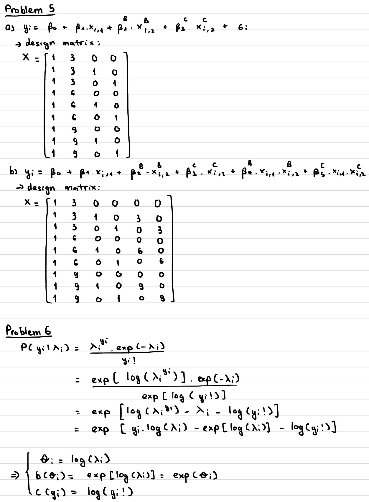

## Problem 1

Alone

## Problem 2

No LLMs

## Problem 3

a)  Since the outcome y of Beta Distribution is from (0, 1), to rescale y to (50, 100) I use: y_scaled \<- 50 \* y + 50

b)  By increasing the precision param phi to be very high, the two groups of the x2 binary start to separate out especially in the range x1 in (-1, 1). This is reasonable as we are making variance to be very small therefore the data samples scatter very close to the logit mean lines of two groups (which is different).

For beta_2 = -1, phi = 200 is enough to separate the two groups. However, for beta_2 = 0.25 then phi = 200 is not enough and a bigger value of phi is needed like phi = 2000.

```{r}
set.seed(230120261)

# Sample size and explanatory variables
N  <- 500
x1 <- rnorm(N, 0, 1)
x2 <- rbinom(N, 1, 0.5)

# True coefficients
beta_0 <- -0.5
beta_1 <- 1.0
beta_2 <- 0.25

# Linear predictor and mean via logit link
eta <- beta_0 + beta_1 * x1 + beta_2 * x2
mu <- 1/(1 + exp(-eta))

# Precision parameter
phi <- 2000

# Simulate response variable from the Beta regression model
alpha <- mu * phi
beta  <- (1 - mu) * phi
y     <- rbeta(N, alpha, beta)

y_scaled <- 50 * y + 50 # Rescale y to interval (50, 100)

plot(x1, y_scaled, col = ifelse(x2 == 1, "blue", "red"), # ylim = c(50,100),
     pch = 19, xlab = "x1", ylab = "y",
     main = "Scatter plot of y vs x1 colored by x2 (1: blue, 0: red)")
```

## Problem 4

a)  Proportion of sand in soil: The proportion are in the range of (0, 1), so Beta Regression could be used

b)  Count of different animal species captured in a trail camera: For count outcome we could use Poisson Regression (assuming the count is number of distinct animal species, not the count number of each different species)

c)  Success of a chemotherapy treatment: The observation are binary (success or failure) of a single trial, so Logistic Regression could be used

d)  Reaction times in a cognitive task with a large cohort of different aged participants: The outcome reaction times is a positive real value, so Gamma Regression could be used

## Problem 5 & 6

Problem 6 Correction: c(yi) = - log(...)


