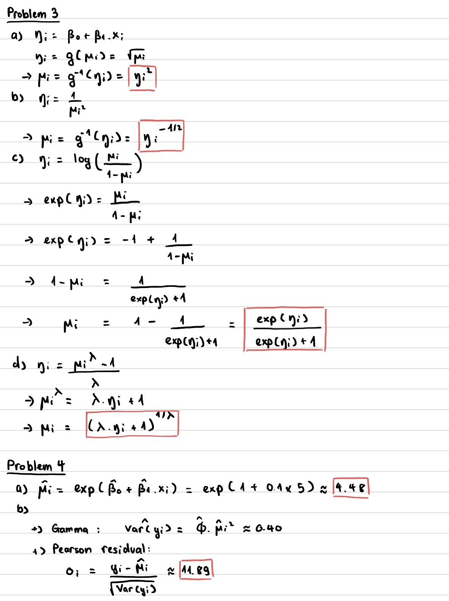

## Problem 1

Alone

## Problem 2

In problem 5, I used the example codes of lecture 6 (normal regression and gamma regression) and example code of lecture 7 (canoladiesel) for references, but I also used ChatGPT to explain some part of the example codes.

## Problem 3 & 4



## Problem 5

a)  Normal Linear Model (predictors girth & height with no interaction); Identity link function

```{r}
blackcherry_data <- read.table("blackcherry.txt", header = TRUE)
# head(blackcherry_data)

normalreg.fit <- glm(Volume ~ Girth + Height, 
                     family=gaussian(link="identity"),
                     data = blackcherry_data)

normalreg.res <- summary(normalreg.fit)
print(coef(normalreg.res))
print(confint(normalreg.fit))
```

b)  Normal Linear Model (predictors girth & height with interaction); Identity link function

```{r}
blackcherry_data <- read.table("blackcherry.txt", header = TRUE)

normalreg.fit <- glm(Volume ~ Girth * Height, 
                     family=gaussian(link="identity"),
                     data = blackcherry_data)

normalreg.res <- summary(normalreg.fit)
print(coef(normalreg.res))
print(confint(normalreg.fit))
```

c)  Normal Linear Model (scaled predictors girth & height with interaction); Identity link function

```{r}
blackcherry_data <- read.table("blackcherry.txt", header = TRUE)

normalreg.fit <- glm(Volume ~ scale(Girth) * scale(Height), 
                     family=gaussian(link="identity"),
                     data = blackcherry_data)

normalreg.res <- summary(normalreg.fit)
print(coef(normalreg.res))
print(confint(normalreg.fit))
```

d)  Gamma Regression (predictors girth & height with interaction); Log link function

```{r}
blackcherry_data <- read.table("blackcherry.txt", header = TRUE)

normalreg.fit <- glm(Volume ~ Girth * Height, 
                     family=Gamma(link="log"),
                     data = blackcherry_data)

normalreg.res <- summary(normalreg.fit)
print(coef(normalreg.res))
print(confint(normalreg.fit))
```
