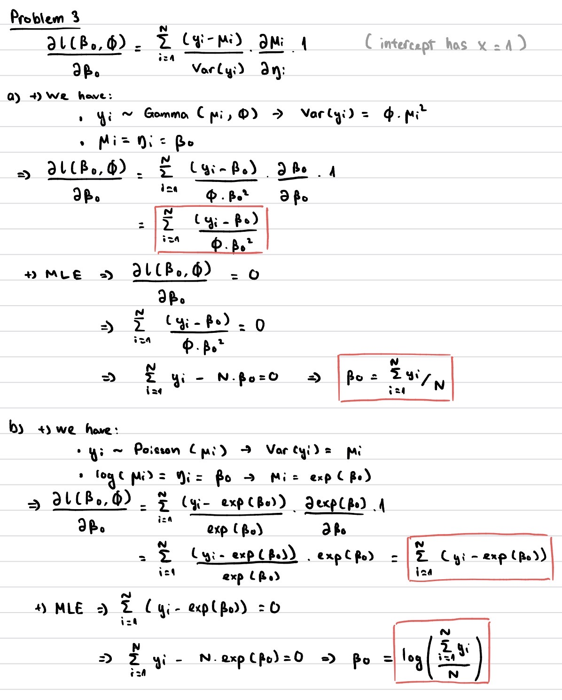
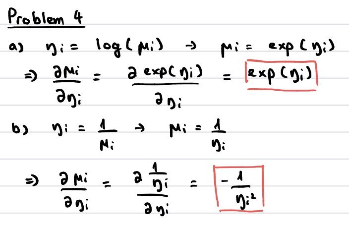

## Problem 1

Alone

## Problem 2

LLM is used for problem 5 part b: even though for problem 5 I mostly used the example_malaria.R from lecture 8 for reference, for part b I did use LLM (Copilot) for help with generating the newdata part for this particular problem, and also for explaining the example code.

## Problem 3



## Problem 4



## Problem 5

a)  Since both predictors sex and food are categorical, I will only try to fit the model with combinations like just using sex, just using food, using sex and foot with and without interaction.

```{r}
babyfood_data <- read.table("babyfood.txt", header = TRUE)
# head(babyfood_data)

fit1 <- glm(cbind(disease, nondisease) ~ sex, 
            family=binomial("logit"),
            data = babyfood_data)

fit2 <- glm(cbind(disease, nondisease) ~ food, 
            family=binomial("logit"),
            data = babyfood_data)

fit3 <- glm(cbind(disease, nondisease) ~ sex + food, 
            family=binomial("logit"),
            data = babyfood_data)

fit4 <- glm(cbind(disease, nondisease) ~ sex * food, 
            family=binomial("logit"),
            data = babyfood_data)

AIC(fit1, fit2, fit3, fit4)
# The best model (with lowest AIC) is fit3
fit <- fit3

res <- summary(fit)
print(coef(res))
print(confint(fit))
```

b)  

```{r}
newdata <- data.frame(sex="Boy", food="Suppl")
pred <- predict(fit, newdata=newdata, type="link", se.fit=TRUE)

eta_hat <- pred$fit
eta_se  <- pred$se.fit

alpha <- 0.05
z <- qnorm(1 - alpha/2)

eta_lo  <- eta_hat - z * eta_se
eta_hi  <- eta_hat + z * eta_se

mu_hat <- fit$family$linkinv(eta_hat)
mu_lo   <- fit$family$linkinv(eta_lo)
mu_hi   <- fit$family$linkinv(eta_hi)

data.frame(
  prob = mu_hat,
  lower = mu_lo,
  upper = mu_hi
)
```
