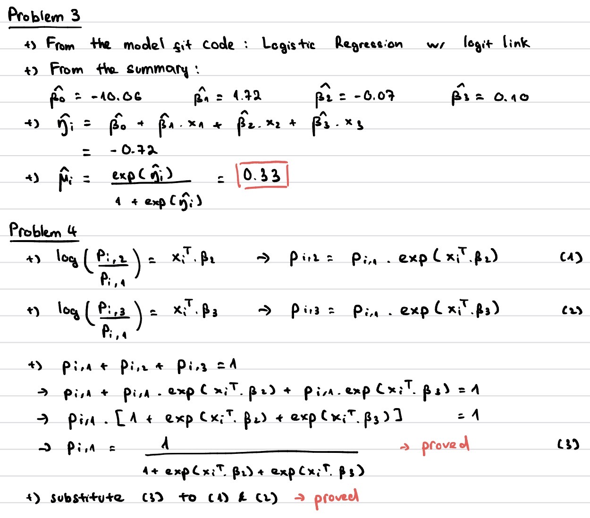
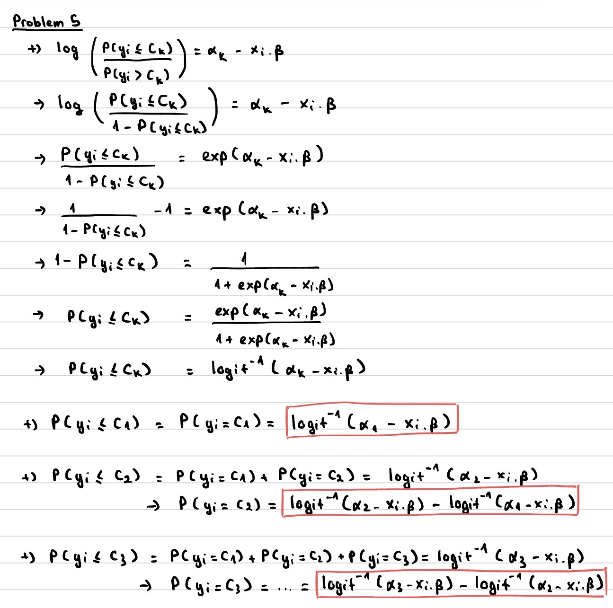

## Problem 1

Alone

## Problem 2

LLM is used in problem 3 to help me understand that finding the MLE for mu is actually using the estimate beta from MLE (which can be seen in the output summary) to calculate mu.

LLM is also used in problem 6 on how to fit negative binomial regression (I can't find any example lecture code for it on Moodle).

## Problem 3 & 4



## Problem 5



## Problem 6

a)  AIC is used to compare between two models. Negative Binomial Regression with slightly lower AIC is selected.

```{r}
library(MASS)

insurance_data <- read.table("insurance_claims.txt", header = TRUE)
# head(insurance_data)

# Poisson Regression
pois.fit <- glm(claims ~ age + income + urban, 
                family=poisson(link="log"),
                data=insurance_data)
pois.res <- summary(pois.fit)
print(coef(pois.res))
print(AIC(pois.fit))

# Negative Binomial Regression
negbin.fit <- glm.nb(claims ~ age + income + urban,
                     data=insurance_data)
negbin.res <- summary(negbin.fit)
print(coef(negbin.res))
print(AIC(negbin.fit))
```

b)  

```{r}
newdata <- data.frame(age=40, income=50.00, urban=1)
pred <- predict(negbin.fit, newdata=newdata, type="response")
print(pred)
```
